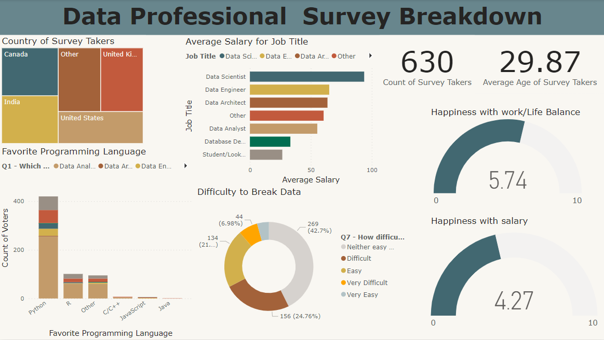

# Data Professional Survey Breakdown

## Overview

The "Data Professional Survey Breakdown" Power BI project provides a comprehensive analysis of survey data related to data professionals. This project aims to uncover insights, trends, and patterns within the dataset, offering a valuable resource for understanding the landscape of the data professional community.

## Features

### Data Cleaning

The dataset undergoes a rigorous data cleaning process to ensure accuracy and reliability. This includes handling missing values, addressing outliers, and standardizing data formats, creating a robust foundation for meaningful analysis.

### Visualizations

Diverse and informative visualizations have been crafted to present key findings in an accessible manner. These visualizations encompass various charts, graphs, and dashboards that dynamically showcase trends, distributions, and correlations within the data.

### Averaging Transformation

An essential aspect of this project revolves around the transformation of a single column, originally containing values within a range (e.g., 125-145k). Following meticulous data cleaning procedures, this column was split into two distinct columns, representing the lower and upper bounds of the range. Subsequently, the project computed the average of these values, providing a refined perspective and enhancing the interpretability of the underlying patterns.

## How to Use

- Prerequisites: Ensure that you have Power BI Desktop installed.
- Clone the Repository: Clone this repository to your local machine.
- Open in Power BI: Launch Power BI Desktop and open the project file (Data_Professional_Survey_Breakdown.pbix).
- Explore and Analyze: Interact with the various visualizations and dashboards to gain insights into the data professional survey breakdown.

## Contributing

If you find issues or have suggestions for improvements, please feel free to open an issue or submit a pull request.
